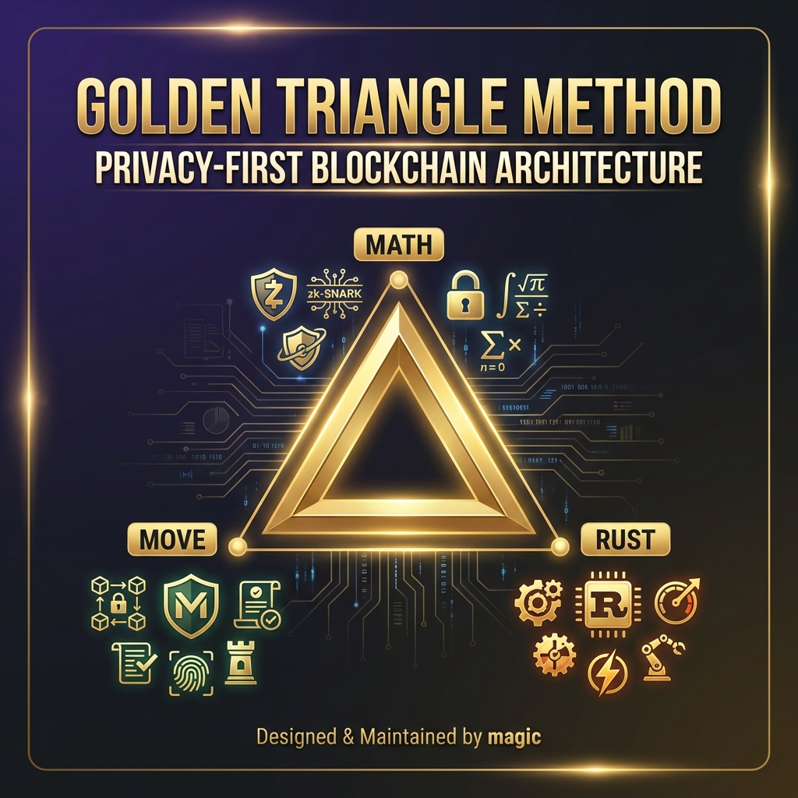

# The Golden Triangle Method

## Privacy-First Blockchain Architecture

**Designed & Maintained by magic**

The **Golden Triangle Method** is a revolutionary open-source framework for building privacy-preserving blockchain systems by combining three foundational pillars: **Mathematics**, **Secure Programming**, and **High-Performance Computing**.

📄 **[Read the Full Whitepaper](./WHITEPAPER.md)** for comprehensive technical details, security analysis, and performance benchmarks.

---

## 🔺 The Three Pillars

### 1. **MATH (The Shield)** 🛡️
**Leveraging ZK-SNARKs (Groth16) for Mathematically Indisputable Privacy**

- **Zero-Knowledge Proofs**: Ensures transactions are proven valid without revealing any sensitive information
- **Groth16 Implementation**: Industry-standard zkSNARK scheme offering:
  - Constant proof size (~200 bytes)
  - Fast verification times
  - Mathematical guarantees of privacy
- **Privacy Guarantees**: 
  - Transaction amounts remain hidden
  - Sender and receiver identities are protected
  - Proof generation ensures computational integrity

**Key Features:**
- Non-interactive proofs
- Cryptographically secure under discrete logarithm assumptions
- Enables trustless privacy without revealing transaction details

---

### 2. **MOVE (The Logic)** 🎯
**Utilizing Sui's Move Language for Asset-Oriented Smart Contracts**

- **Resource-Oriented Programming**: Assets are first-class citizens that cannot be duplicated or lost
- **Native Security**: Move's type system prevents common vulnerabilities:
  - No reentrancy attacks
  - No double-spending
  - Linear types ensure asset safety
- **Privacy Pool Management**: Smart contracts that manage shielded transactions with:
  - Secure deposit mechanisms
  - Privacy-preserving withdrawal protocols
  - On-chain proof verification

**Why Move?**
- Designed for digital assets from the ground up
- Formal verification capabilities
- Native parallelization support on Sui
- Enhanced security through ownership model

---

### 3. **RUST (The Engine)** ⚙️
**Powering High-Speed Sequencer with Maximum Efficiency**

- **Off-Chain Computation**: Handles complex ZK proof generation off-chain
- **Performance Characteristics**:
  - Zero-cost abstractions
  - Memory safety without garbage collection
  - Fearless concurrency
- **Sequencer Responsibilities**:
  - Batches private transactions
  - Generates ZK-SNARK proofs
  - Manages Layer 2 state
  - Coordinates with Layer 1 smart contracts

**Rust Advantages:**
- Native performance comparable to C/C++
- Memory safety guarantees
- Rich ecosystem for cryptographic libraries
- Perfect for zkSNARK computation pipelines

---

## 🏗️ Architecture Overview

```
┌─────────────────────────────────────────────────────────┐
│                   Golden Triangle Stack                  │
├─────────────────────────────────────────────────────────┤
│                                                           │
│  ┌───────────┐      ┌───────────┐      ┌───────────┐   │
│  │   MATH    │◄────►│   MOVE    │◄────►│   RUST    │   │
│  │ (Shield)  │      │  (Logic)  │      │  (Engine) │   │
│  └───────────┘      └───────────┘      └───────────┘   │
│       │                   │                   │          │
│       ▼                   ▼                   ▼          │
│  ZK-SNARKs          Move Smart         Sequencer        │
│  (Groth16)          Contracts          (Off-chain)      │
│                                                           │
└─────────────────────────────────────────────────────────┘
```

---

## 🔄 How It Works

### Transaction Flow

1. **User Initiates Private Transaction** (Frontend)
   - Generates commitment using zkSNARK circuit
   
2. **Proof Generation** (Rust Sequencer)
   - Creates zero-knowledge proof of transaction validity
   - Batches multiple transactions for efficiency
   
3. **On-Chain Verification** (Move Smart Contract)
   - Verifies zkSNARK proof on Sui blockchain
   - Updates privacy pool state
   - Emits events for off-chain indexing

4. **Settlement** (Layer 1)
   - Finalizes transaction on Sui mainnet
   - Maintains privacy guarantees throughout

---

## 🎯 Use Cases

### Privacy-Preserving DeFi
- Anonymous token transfers
- Private trading pools
- Shielded lending protocols

### Enterprise Solutions
- Confidential business transactions
- Supply chain privacy
- Private payroll systems

### Personal Finance
- Anonymous payments
- Private savings
- Confidential fund transfers

---

## 🔐 Security Guarantees

| Component | Security Feature | Guarantee |
|-----------|-----------------|-----------|
| **Math** | ZK-SNARKs | Computational privacy |
| **Move** | Type Safety | Asset security |
| **Rust** | Memory Safety | No vulnerabilities |

---

## 🚀 Performance Metrics

- **Proof Generation**: ~2-5 seconds per transaction
- **On-Chain Verification**: <100ms
- **Throughput**: Batching enables high transaction volume
- **Cost**: Gas-efficient verification on Sui

---

## 📊 Technology Stack

```yaml
Layer 1 (Blockchain):
  - Sui Network
  - Move Smart Contracts
  - On-chain proof verification

Layer 2 (Off-chain):
  - Rust Sequencer
  - ZK-SNARK proof generation
  - State management

Cryptography:
  - Groth16 zkSNARK scheme
  - BN254 elliptic curve
  - Poseidon hash function
```

---

## 🛠️ Development Principles

### 1. **Security First**
- Formal verification where possible
- Comprehensive testing
- Audited cryptographic implementations

### 2. **Privacy by Default**
- Zero-knowledge architecture
- No metadata leakage
- Minimal on-chain footprint

### 3. **Performance Optimized**
- Batched proof generation
- Efficient on-chain verification
- Parallelized computation

---

## 📚 Getting Started

### Prerequisites
- **Rust** (1.70+): For Sequencer development
- **Sui CLI**: For Move contract deployment
- **Node.js**: For frontend integration

### Quick Start

```bash
# Clone the repository
git clone https://github.com/dz-Cipher/Golden-Triangle-Method.git
cd Golden-Triangle-Method

# Install Rust dependencies
cargo build --release

# Deploy Move contracts
sui move build
sui client publish --gas-budget 200000000

# Run the Sequencer
cargo run --release
```

---

## 🤝 Contributing

We welcome contributions that enhance any pillar of the Golden Triangle:
- **Math**: Cryptographic optimizations
- **Move**: Smart contract improvements
- **Rust**: Sequencer performance enhancements

---

## 📖 Learn More

### Academic Papers
- [Groth16: On the Size of Pairing-based Non-interactive Arguments](https://eprint.iacr.org/2016/260)
- [Move: A Language With Programmable Resources](https://developers.diem.com/papers/diem-move-a-language-with-programmable-resources/2019-06-18.pdf)

### Documentation
- [Sui Move Documentation](https://docs.sui.io/build/move)
- [ZK-SNARK Explainers](https://z.cash/technology/zksnarks/)
- [Rust Book](https://doc.rust-lang.org/book/)

---

## 🏆 Why Golden Triangle?

The triangle is the strongest geometric shape - each side supports the others:

- **Math** proves privacy is real
- **Move** ensures assets are safe
- **Rust** delivers the performance

Together, they create an unbreakable foundation for privacy-preserving blockchain applications.

---

## 📜 License

MIT License - See [LICENSE](./LICENSE) for details

---

## 👥 Author

**magic** - *Creator & Maintainer of the Golden Triangle Method*

---

## 🌟 Acknowledgments

- Sui Foundation for the Move language
- Zcash for pioneering zkSNARK adoption
- Rust community for building secure systems

---

**Built with the Golden Triangle Method** 🔺

*Where Mathematics, Logic, and Performance converge to create uncompromising privacy.*
